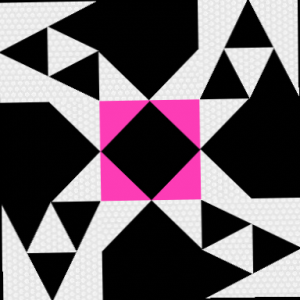
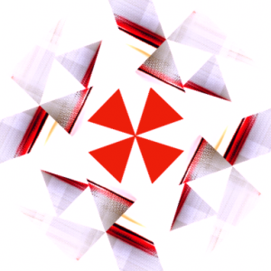
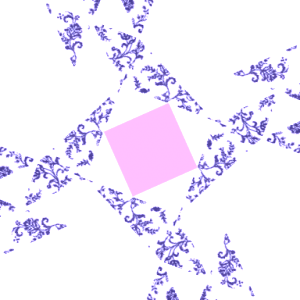
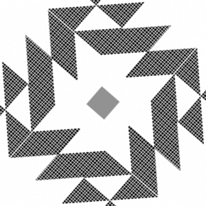
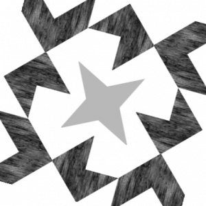
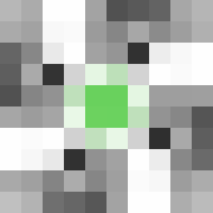

## EXCERPT from Wikipedia

An Identicon is a visual representation of a hash value, usually of the
IP address, serving to identify a user of a computer system. The
original Identicon is a 9-block graphic, which has been extended to
other graphic forms by third parties some of whom have used MD5 instead
of the IP address as the identifier. In summary, an Identicon is a
privacy protecting derivative of each user's IP address built into a
9-block image and displayed next the user's name. A visual
representation is thought to be easier to compare than one which uses
only numbers and more importantly, it maintains the person's privacy.
The Identicon graphic is unique since it's based on the users IP, but
it is not possible to recover the IP by looking at the Identicon.


## ABOUT Identicons

Identicons is a lightweight PHP implementation of Don Park's
original identicon code for visual representation of MD5 hash values.
The program uses the PHP GD library for image processing.

The code can be used to generate unique identicons, avatars, and
system-assigned images based on a user's e-mail address, user ID, etc.

Original code taken from: http://sourceforge.net/projects/identicons/
and written by Bong Cosca

This is a refactored and enhanced version.

### Added features

 * Image support
 * Save the identicon
 * Some setter methods

## USAGE

Identicons requires the size (in pixels) and an MD5 hash of
anything that will uniquely identify a user - usually an e-mail address
or a user ID. You can also use MD5 hashes of IP addresses, but bear in
mind that NATed endpoints will usually have the same IP.

Insert the URL in your HTML image tag that looks something like:


```php
$icon = new Identicon();
$icon->setSize( 300 );
$icon->rotator( TRUE ); // more variation to the identicon by rotating it
$icon->setImage( 'niceimage.jpg' ); // use an image exclusively
$icon->hashBase( 'some text whatever' );
$icon->generate( TRUE ); // this will generate the identicon and save it to a path
// or insted of generating, just display it on the output directly
$icon->display();
```

## SAMPLE RENDERS











